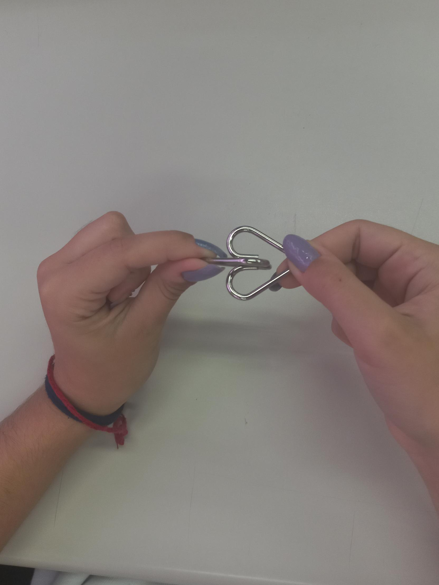
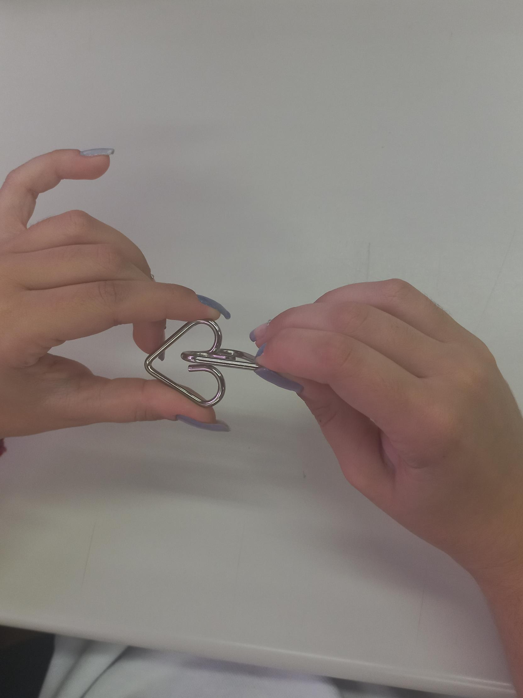
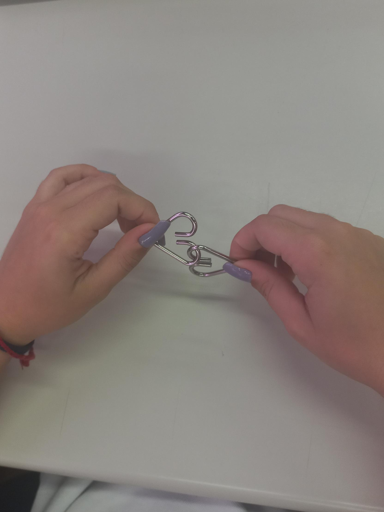
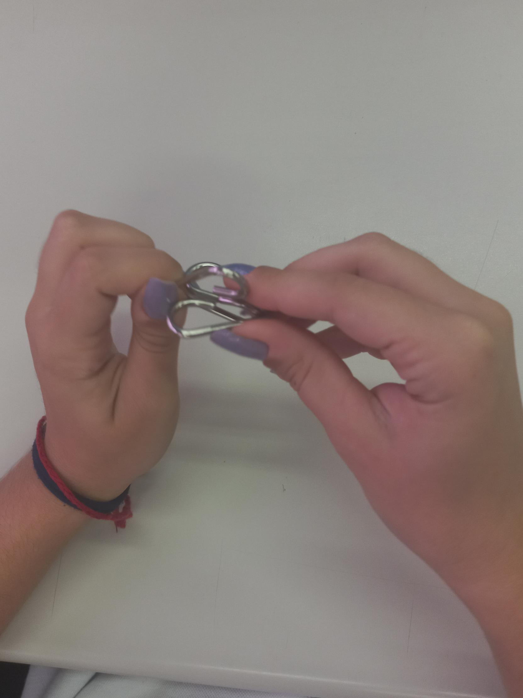
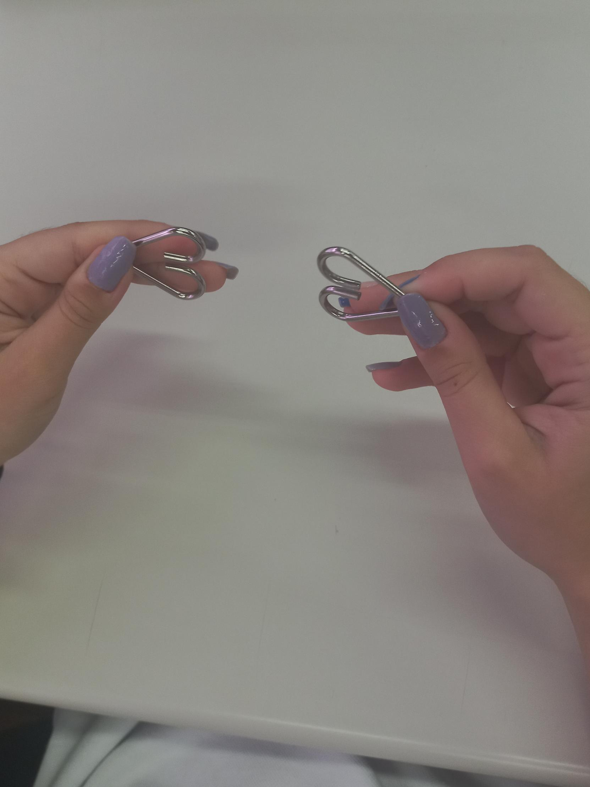

# Manual da montagem e desmontagem dos corações:

## Tutorial para a montagem:

>1- Pegue os dois corações e segure cada um pelas suas pontas;

>2- Deixe um coração na horizontal e outro na vertical de forma de os dois estejam com as aberturas 
alinhadas;

>3- Encaixe a abertura de ambos os corações;

>4- Agora, basta deslizar os dois pelas aberturas e eles vão estar encaixados.

## Tutorial para a desmontagem:

>1- Pegue novamente os corações pelas pontas;

>2- Deixe novamente um na vertical e outro na horizontal, e novamente com as aberturas alinhadas;

>3- Encaixe as aberturas e deslize um coração pelo outro;

>4- Com isso, ambos os corações estarão soltos.
